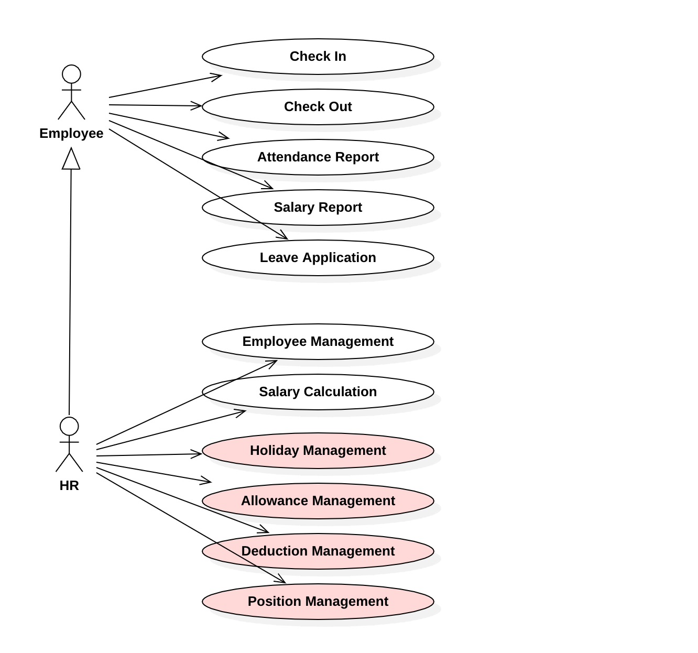
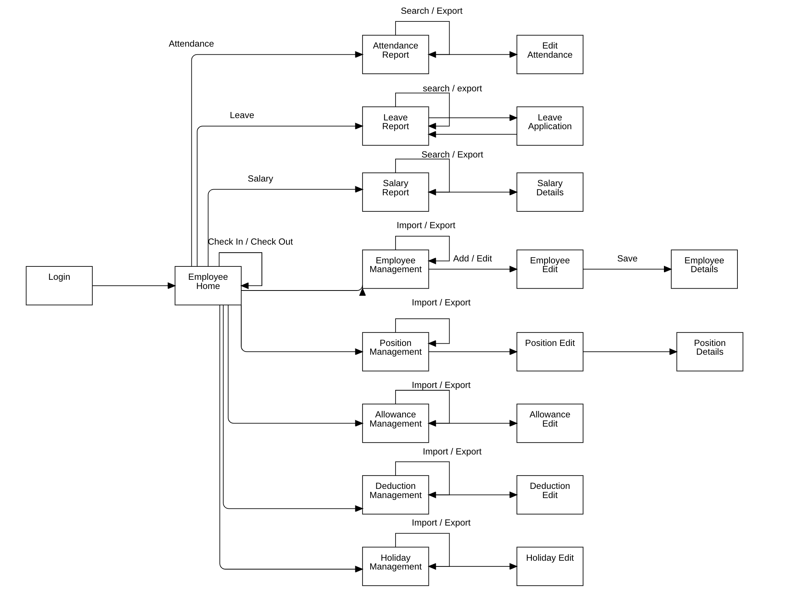

# Final Project for One Stop Batch 7

ကျွန်တော်တို့ JDC ရဲ့ One Stop အတန်းတိုင်းဟာ ၆ လ သင်ကြားပါတယ်။ ပထမ ၂ လကတော့ Java Basic နဲ့ Database အကြောင်းကို လေ့လာကြရမှာပါ။ ပထမ နှစ်လမှာတင် Java Basic ကိုလဲ လေ့လာပြီး Database နဲ့ ပတ်သက်ပြီး MySQL ကို အသုံးပြုပြီး JDBC ကိုကော Hibernate JPA ကိုပါ လေ့လာကြရမှာပါ။ Java သမား တစ်ယောက်အတွက်က Database က အသက်ပဲလေ။ ပြီးတော့ ယနေ့ခေတ် Database တွေကို အသုံးပြုတဲ့ နေရာမှာလဲ Hibernate JPA က Standard တစ်ခုလို ဖြစ်နေတာပဲ။ 

နှစ်လလေ့လာပြီးတဲ့ အခါမှာ Framework တွေကို စပြီးလေ့လာကြရပါတယ်။ Backend အတွက် Spring Framework, Front End အတွက်ကတော့ Angular နှင့် React JS တို့ကို သင်ကြားသွားပါတယ်။ ဒီအချိန်မှာပဲ သင်ကြားနေတဲ့ ဆရာက Project လေးတစ်ခုကို ပုံစံအမျိုးမျိုးဖြင့် ရေးသားသင်ကြားသွားပါတယ်။ 

အစပိုင်းမှာတော့ Spring MVC နဲ့ Thymeleaf ကို သုံးပြီးရေးတယ်။ နောက်ပိုင်းမှာတော့ Spring REST ကို သုံးပြီး FE ကတော့ Angular ပြီးတော့ React နဲ့ ပါရေးသားနိုင်အောင် သင်ကြားသွားပါတယ်။ 

အဲ့ဒါတွေကို လေ့လာကြရတာကတော့ ၃ လပါခင်ဗျာ။ နောက်ဆုံးတစ်လကတော့ Final Project ကို ရေးသားကြပါတယ်။ ကျောင်းသားတွေနဲ့ ဆရာတွေနဲ့ တိုင်ပင်ပြီး ဘာရေးကြမလဲဆိုတာကို စဉ်းစားပြီး အစကနေ ရေးသားသွားကြတာပါ။ 

ဒီတစ်ခေါက် One Stop Batch 7 မှာတော့ Payroll Management System လေး ရေကြရအောင်ဆိုပြီး ရေးဖြစ်ခဲ့ပါတယ်။ 

## Project Proposal

ကလေးတစ်ယောက်က Payroll Management System လေး ဘယ်လိုရေးသလဲ သိချင်တယ် ပြောလာခဲ့ပါတယ်။ ဒါနဲ့ ကျွန်တော်တို့ စပြီး စဉ်းစားခဲ့ကြတာက Usecase Diagram လေးနဲ့ ဖြစ်ပါတယ်။ 

အဲ့ဒီလို Functional Requirements တွေကို စဉ်းစားခဲ့ကြပြီး ဆက်ပြီး စဉ်းစားဖြစ်ခဲ့ကြတာ့တော့ ဒီ Requirements တွေကို ဖြစ်အောင် ရေးဖို့အတွက် ဘယ်လို Presentation မျိုးလုပ်ရင်ကောင်းမလဲ ဆိုတာပါပဲ။ ဒီနေရာမှာ အသုံးပြုခဲ့ကြတာကတော့ Page Flow Diagram ပဲ ဖြစ်ပါတယ် ခင်ဗျာ။ 

Developing လုပ်ကြတဲ့ နေရာမှာ စစချင်း စဉ်းစားကြရမှာက ဘာလုပ်ချင်တာလဲ ဆိုတဲ့ အပိုင်းဖြစ်ပါတယ်။ ဘာလုပ်ချင်တာလဲ ဆိုတာကို သေချာသိပြီးမှ ဆက်ပြီး စဉ်းစားကြရမှာက ဘယ်လိုလုပ်ရင် အကောင်းဆုံးဖြစ်မလဲဆိုတဲ့ အပိုင်းဖြစ်ပါတယ်ဗျာ။ 

Usecase Diagram နဲ့ ဘာတွေလုပ်မှဖြစ်မှာလဲ၊ ဘာတွေလိုအပ်တာလဲ ဆိုတဲ့ Requirements တွေကို စဉ်းစားပြီးတဲ့ အခါမှာ အဲ့ဒါတွေကို ရအောင် ဘယ်လို Solution မျိုးပေးမှာလဲ ဆိုတဲ့ Presentation အပိုင်းကို ဆက်ပြီး စဉ်းစားခဲ့ကြပါတယ်။ ဒီနေရာမှာတော့ ကျွန်တော်တို့က Page Flow Diagram လေးကို ရေးပြီး လိုချင်တာတွေကို ရဖို့ ဒီလိုသွားမယ်လို့ စဉ်းစားခဲ့ပါတယ်။ 

တကယ်တမ်းဆိုရင် ကြားထဲမှာ ထပ်ပြီး စဉ်းစားရမည့် အပိုင်းတွေရှိပါသေးတယ်။ ဒါပေမဲ့ Project Scope ကို တွေးပြီး Page Flow Diagram လေး ထွက်လာတာနဲ့ ကျွန်တော်တို့ကတော့ Angular လေးကို အသုံးပြုပြီး Prototype လေးကို ရေးခဲ့ကြပါတယ်။ 

## Prototyping

Page Flow Diagram လေး ထွက်ပြီးတဲ့ နောက်မှာ ကျွန်တော်တို့တွေ အဲ့ဒီလို Navigation တွေ အတိုင်း Prototype လေးကို ဆက်ရေးလို့ရလာပါပြီ။ 

ဒီနေရာမှာ Frigma လို ပုံဆွဲတဲ့ Tools တွေနဲ့ ပုံတွေ ဆွဲပြီး ဘယ်လို အလုပ်လုပ်မယ်ဆိုတာကို စဉ်းစားကြမှာ ဖြစ်ပေမဲ့ ကျွန်တော်ကတော့ ပုံဆွဲနေတာ အချိန်ကြာလို့ Prototype ကို Angular နဲ့ပဲ ရေးခဲ့ပါတယ်။ 

Prototype ကို ရေးသားကြတဲ့ နေရာမှာ View တိုင်းမှာ ဘာလုပ်ချင်တာလဲ။ အဲ့ဒါတွေကို ဖြစ်အောင် ဘယ်လို လုပ်ကြရမှာလဲ ဆိုတာနဲ့ ဘယ်လို Data တွေကို ပြမှာလဲ ဆိုတာက အဓိကဖြစ်ပါတယ် ခင်ဗျာ။ 

အဲ့ဒါတွေအားလုံးဟာလဲ ရှေ့မှာ စဉ်းစားခဲ့ကြတဲ့ အချက်တွေအပေါ် အခြေခံပြီးရေးသားကြရမှာပါ။ Agile Methodology နဲ့ သွားမယ် ဆိုရင် ဒီနေရာမှာ စဉ်းစားပြီးရေးရင်းနဲ့ ပိုပြီးကောင်းအောင် ပြင်ဖို့လိုတယ်ဆိုရင် ပြင်သွားကြရမှာပါ။ 

Agile ဆိုတာ ဒါပါပဲ။ ရေးကြည့်လိုက် End User နဲ့ တိုင်ပင်လိုက် လိုအပ်ရင်ပြင်ပြီးသွားလိုက်ဖြစ်နေကြရမှာပါ။ 

ကျွန်တော်တို့ ဒီအတန်းမှာတော့ Page Flow Diagram လေးရေးပြီးတာနဲ့ Angular နဲ့ Navigation ပါရတဲ့ UI လေးတွေ ရေးသားခဲ့ကြပါတယ် ခင်ဗျာ။ 